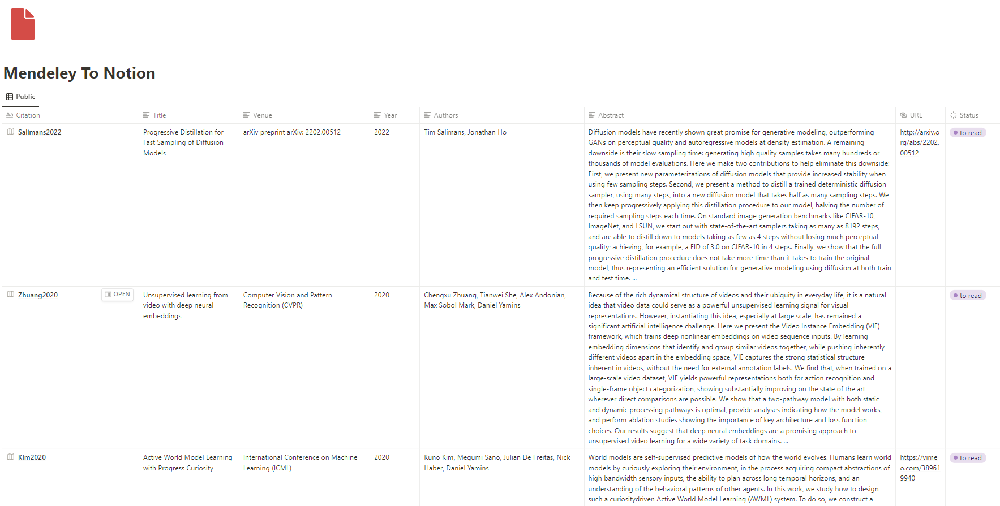

<div align="center">    
 
# Mendeley To Notion  


  
</div>

## Description 
This project allows you to export newly added or recently updated documents in Mendeley to your Notion database via the APIs provided by the two. If you'd like the export to happen as soon as you make a change in Mendeley, then you can run the script `scripts/runMendToNotion.sh` peridocially at a reasonable frequency via a `crontab` job.

## Directory Structure

```
.
+-- docs/
|   +-- images/
|   |   +-- demo.png
|   |   +-- icon.png
+-- globalStore/
|   +-- constants.py
+-- lib/
|   +-- port_utils.py
|   +-- utils.py
+-- mendeley/
|   +-- auth.py
|   +-- session.py
|   +-- ...
+-- notebooks/
|    +-- trial.py
+-- scripts/
|   +-- runMendToNotion.sh
+-- secrets/
|   +-- secrets_mendeley.json
|   +-- secrets_notion.json
+-- src/
|   +-- mendeleyToNotion.py
+-- .gitignore
+-- environment.yml
+-- juyptext.toml
+-- README.md
+-- requirements.txt
+-- STDOUTlog_examples.txt
```

---

---

## Update
This hasn't been tested out after Mendeley's Sept 1, 2022 changes. It is not clear how long the API will remain available for easy access to Mendeley data.

## Usage
1. Register an app on Mendeley's developer portal (follow instructions online)
2. Obtain its `clientID`, `clientSecret` and `redirectURL` and add it to `secrets/secrets_mendeley.json` in the following format:
```
{
    "clientId": "your client ID", 
    "clientSecret": "your client secret", 
    "redirectURL": "your client redirect URL"
}
```
3. Register a private integration on your Notion workspace (follow instructions [online](https://www.notion.so/help/create-integrations-with-the-notion-api#create-an-internal-integration))
4. Obtain its `notionToken`
5. Create a database on Notion to contain all the entries from Mendeley. Make sure it has the following properties. If you want to add more properties or remove, modify the function `getPropertiesForMendeleyDoc` and `getNotionPageEntryFromPropObj` in `lib/port_utils.py`.
```
Title property: Citation
Text properties: TItle, UID, Authors, Venue, Year, Abstract, Type, BibTex, Filename, ARXIV, DOI, ISSN, ISBN, PMID
Url properties: Filepath
Date properties: Created At, Last Modified At
```
6. Get its `databaseID` and add it to `secrets/secrets_notion.json` in the following format:
```
{
    "notionToken": "your notion token",
    "databaseID": "your notion database ID"
}
```
7. Run the python script `src/mendeleyToNotion.py` with `--secretsFilePath` argument as `secrets/secrets_mendeley.py`.
8. Authenticate your Mendeley app by logging in. It will automatically generate a token and add it to your `secrets/secrets_mendeley.py`.
9. Currently, the logic reads all items from the Mendeley API as an Mendeley Object iterator and reads all items in the Notion database. For each item in Mendeley, we check if it already exists in Notion. If yes, we check if the last modified time on Mendeley is AFTER the last edited time in Notion. If yes, we update the Notion entry. If not, there's nothing to update. If the Mendeley item doesn't exist in Notion, we create a brand new row in Notion. 
10. You can periodically run this file again as a script `scripts/runMendToNotion.sh` using a crontab job to get periodic updates. For more information on Crontab, check out this [reference](https://crontab.guru/).

## Sources

- [Notion API Python SDK](https://github.com/ramnes/notion-sdk-py)
- [Mendeley Yython SDK](https://github.com/Mendeley/mendeley-python-sdk)

**Note**: I wanted to make use of the [mendeley python sdk](https://github.com/Mendeley/mendeley-python-sdk) directly, but their `auth` code has issues with the `refresh` method. Instead, I have cloned the `mendeley` project and made changes to it locally, most notably in the `MendeleyAuthorizationCodeTokenRefresher` class in `mendeley/auth.py`
```
def refresh(self, session):
    #oauth = OAuth2Session(client=self.client, redirect_uri=self.redirect_uri, scope=['all'], token=session.token)
    #print(session.token)
    #oauth.compliance_hook['access_token_response'] = [handle_text_response]

    #session.token = oauth.refresh_token(self.token_url, auth=self.auth)
    session.refresh_token(self.token_url, auth=self.auth)
    #print(session.token)
```

## If you use it in your work and want to adapt this code, please consider starring this repo or forking from it!

```
@misc{nanbhas2021_mendeleyToNotion,
  title={Mendeley To Notion},
  author={Nandita Bhaskhar},
  journal={GitHub Repo, https://github.com/nanbhas/MendeleyToNotion},
  year={2021}
}
``` 
